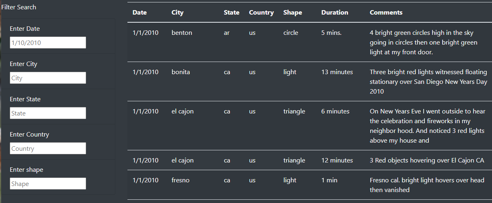

# UFOs
## Overview and purpose
Whether aliens are real or not, no one can argue the power of javaScript is very real. JavaScript is a vastly used online and it comes with all sorts of tools to make wabepages interact with the user.
In this project, we will be using javaScript to parse and filter a jason file on to a HTML table. This table can be filtered through input boxes and updated, it's out of this world!
## Analisys
UFO sighting enthusiast "Dana" wants to create a website than can be access by anyone, and filtered with information that shes gather throughout the years:  
- Date
- City
- State
- Country
- Shape  

Using a simple HTML table template, we'll be using javaScript to parse the data automatically:
  

In the following image we can see the table has been updated after users enters the chosen filters and hit enter:  

## Summary
This code delivers with a fairly simple and small code.
One drawback about this code is the country filter, there is only data for the US, which means, that filer is useless.
Another drawback is the fact that we are uploading a json file to our website, which means that very large files will take longer to parse and filter.
If we wanted to update our data, MongoDb would be more suited for that task, while keeping a fast and accurate response for the user.
If there is no intention to add more data from different countries, we could eliminate the country filter.